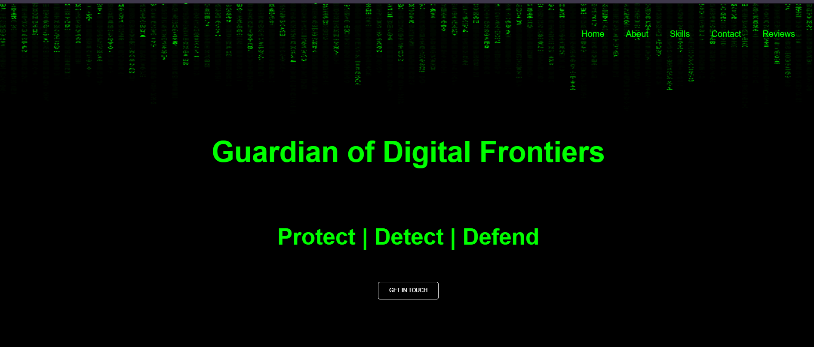

# 🛡️ CyberSec Portfolio - Guardian of Digital Frontiers  

Welcome to **Guardian of Digital Frontiers** – a **Cybersecurity Portfolio Website** built with **HTML, CSS, and JavaScript**. This website showcases **my skills, expertise, and projects** in the field of **Cybersecurity**.  

## 🖼 [Live Demo](https://charithabimsara.github.io/Cybersecurity-Portfolio/)




## 🌟 Features  

- **🕵️ Ethical Hacking & Penetration Testing** - Display expertise in security assessment & testing.  
- **🔐 Security Tools & Techniques** - Showcase tools like Kali Linux, Metasploit, and Wireshark.  
- **📜 Certifications & Skills** - Highlight cybersecurity certifications & technical skills.  
- **🖥️ Interactive UI** - A futuristic hacker-themed design with **Matrix-style animations**.  
- **📞 Contact Section** - Get in touch easily via the contact form.  

## 🚀 Getting Started  

### 📥 Clone the Repository  
```sh
git clone https://github.com/YourUsername/CyberSec-Portfolio.git
```
### 🛠 Open in a Code Editor

- Open the project in VS Code, Sublime Text, or any preferred IDE.
- Modify index.html, style.css, and script.js as per your customization needs.

## ▶️ Usage

- Open index.html in your browser.

- Navigate through different sections like Skills, Projects, Certifications, and Contact.

## 🎨 Tech Stack

- **HTML5** 🏗️ – Structure the website.

- **CSS3** 🎨 – Enhance styling & animations.

- **JavaScript** ⚡ – Add interactive elements.

## 🤝 Contributing

If you'd like to enhance features, improve UI, or add security-related content, feel free to fork and submit a pull request.

### 🛡️ Secure, Detect, Defend – Stay Cyber Safe! 🔥
